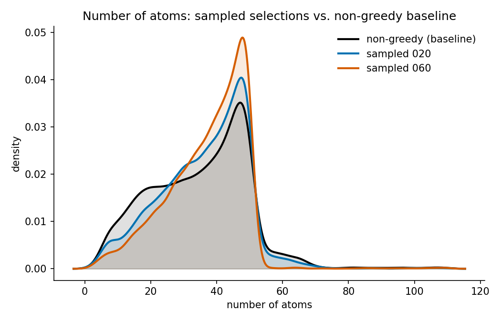
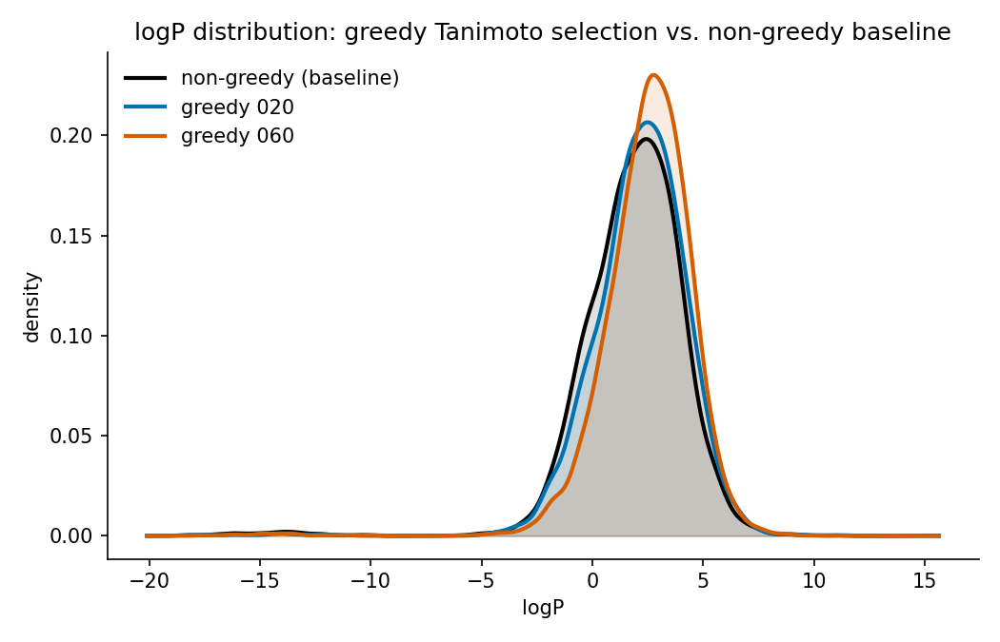
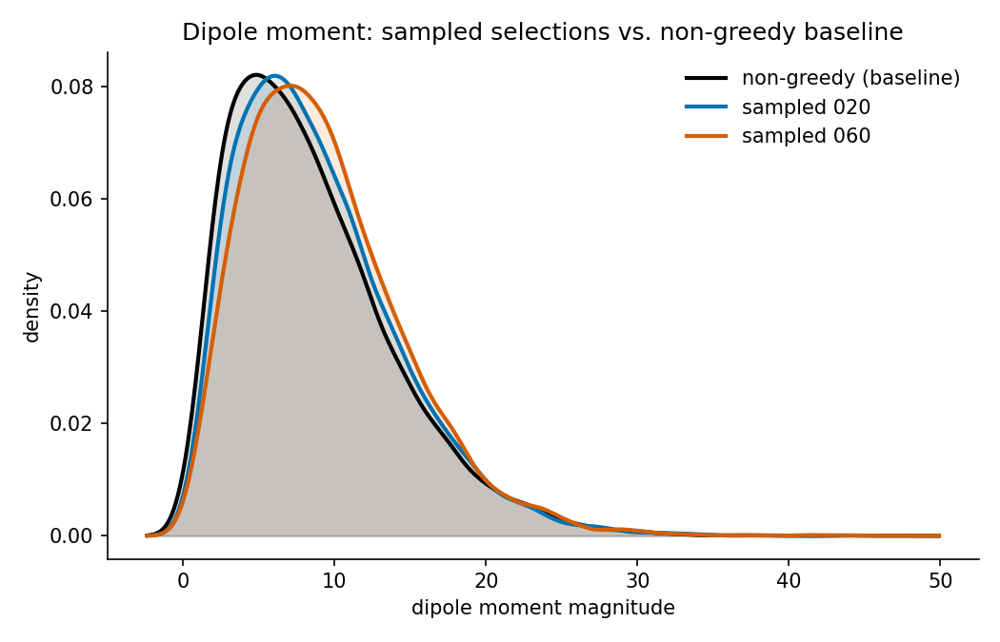
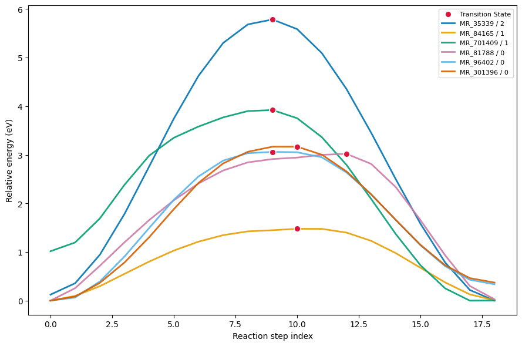

# Advanced Tutorials

Moving beyond standard CLI usage, this guide walks you through more advanced,
hands-on examples. You will learn how to:

- Execute queries directly through Python objects
- Construct leak-free train/validation/test splits for your curated datasets
- Perform post-export dataset audits
- Curate and refine chemistry data

These examples build upon the [CLI command references](cli.md),
[configuration reference](../reference/configs.md), and
[query examples](../reference/query_examples.md).

```{note}
These examples illustrate the workflow — adapt the thresholds and methods to
your own data and scientific requirements.
```

**Prerequisite:** This guide assumes you have already created a processed
query database (Parquet files) during the `process` step.

(shared-setup)=
## Shared Setup

All examples in this guide use the `QueryDatabaseHandler` class to interact
with your query database — see the examples below for how to construct and
use it. You can initialize it with the default reader for standard paths,
or inject a custom reading function for specialized I/O requirements.

### Option A: Default Setup (Standard Local/S3 Path)

Use this approach for standard local directories or cloud storage URIs where
default reading rules apply:

```python
from chemreporter.query_database_tools.query_database import QueryDatabaseHandler

db_path = "path/to/query_database"  # local path or "s3://my-bucket/db"
db_query = QueryDatabaseHandler(db_path)
```

### Option B: Custom Reader Function

If your project requires specific storage options or custom loading logic,
you can pass your own reader function:

```python
import polars as pl
from cloudpathlib import AnyPath

from chemreporter.query_database_tools.query_database import QueryDatabaseHandler


def custom_read_parquet(
    file_path: AnyPath,
) -> pl.LazyFrame:
    """Custom parquet reader applying project-specific storage options."""
    return pl.scan_parquet(str(file_path))


db_path = AnyPath("path/to/query_database")  # local path or s3:// URI
db_query = QueryDatabaseHandler(db_path, read_func=custom_read_parquet)
```

---

(querying-and-filtering-data)=
## Querying and Filtering Data

Begin by filtering entries based on specific molecular properties, using the
`db_query` object created above. The API accepts SQL-like syntax, allowing
you to filter across any schema field seamlessly.

```python
query = "net_force_norm < 1.0e-3 AND "
query += "max_force_norm < 15 AND "
query += "is_molecular_structure_valid"

keys = db_query.query_to_keys(query)
```

This is what you would see, for instance, if your query database has OMOL25
processed into it:

```text
🔍 Query: net_force_norm < 1.0e-3 AND max_force_norm < 15 AND is_molecular_structure_valid
✅ Found 103,699,333 molecules matching the criteria
```

To extract a subsample of the query results, simply pass the sampling keyword arguments:

```python
keys_sampled = db_query.query_to_keys(
    query, sampling_method="random", n_samples=1000
)
```

Matching keys feed directly into three built-in analysis actions, each
operating on the same `db_query` object and the same array of entry keys:
`make_histograms` plots a histogram for one or more columns, `make_statistics`
writes summary statistics (count, mean, min, max, ...) to a CSV file, and
`extract_smiles` extracts the SMILES strings of the matched entries into a
`.npy` file. All three are importable from
`chemreporter.query_database_tools.actions_tools`. The example below plots a
histogram of `max_force_norm`:

```python
from pathlib import Path

from chemreporter.query_database_tools.actions_tools import make_histograms

make_histograms(
    db_handler=db_query,
    entry_keys=keys_sampled,
    output_path=Path("/path/to/output_dir"),
    column_names=["max_force_norm"],
)
```

Save these keys to a file (e.g., `filtered_keys.npy`), and you have exactly
what the HDF5 export step requires.

To explore available query fields, you can inspect `FULL_SCHEMA`. It
provides comprehensive documentation, including field names and
descriptions, eliminating any guesswork:

```python
from chemreporter.query_database_tools.table_schemas import FULL_SCHEMA

for field in FULL_SCHEMA:
    print(f"{field.name}: {field.description}")
```

If the built-in actions aren't enough, `db_query.get_dataframe(indices=keys,
columns=[...])` gives you the raw Polars DataFrame for the matched keys, so
you can filter, join, or transform it however your analysis requires. The
next sections rely on this, too.

---

## Constructing Leak-Free Data Splits

To avoid data leakage, split by molecular identity, not by row: if the same
molecule (identified by its canonical `smiles`) ends up in both your training
and test sets — even as a different conformation or with a different
label — your test metrics stop measuring generalization to unseen chemistry.
Splitting on unique `smiles` values, rather than randomly across all rows,
keeps every occurrence of a given molecule on the same side of the split.

Reactive datasets add another axis of leakage on top of this: structures
along the same reaction pathway (e.g. reactant, transition state, product)
share the same underlying reaction, so splitting them across training and
test still leaks information about that reaction. For these datasets,
partition by unique `reaction_id` instead of `smiles` — the example below
does exactly that for the RGD subset of OMOL25, and generalizes directly to
a plain molecule split if you swap `reaction_id` for `smiles` throughout.

One effective, leakage-free approach is to fetch the `reaction_id` for the
entry `keys` returned by your query (see
[Querying and Filtering Data](querying-and-filtering-data)), collect the
unique reaction IDs, shuffle them, and slice the shuffled list by your
desired fractions:

```python
df = db_query.get_dataframe(indices=keys, columns=["entry_key", "reaction_id"])
unique_reaction_ids = df.select("reaction_id").unique().collect()

# Shuffle the reaction_ids to ensure randomization
unique_reaction_ids = unique_reaction_ids.sample(fraction=1.0, shuffle=True, seed=42)

n = unique_reaction_ids.height

# Allocate 90% of the unique reactions to the training set
n_train = int(0.90 * n)
training_reaction_ids = unique_reaction_ids.slice(0, n_train)
validation_reaction_ids = unique_reaction_ids.slice(n_train)

train_keys = (
    df.join(training_reaction_ids.lazy(), on="reaction_id", how="inner")
    .select("entry_key")
    .collect()
    .sample(n=20000, seed=42)
    .get_column("entry_key")
    .to_numpy()
)

validation_keys = (
    df.join(validation_reaction_ids.lazy(), on="reaction_id", how="inner")
    .select("entry_key")
    .collect()
    .sample(n=2000, seed=42)
    .get_column("entry_key")
    .to_numpy()
)

```

Running this over the RGD subset of OMOL25 (3,359,478 entries spanning
140,672 unique reaction IDs) yields clean, isolated datasets:

```text
There are 66115 training reaction ids

We have 20000 samples in the training split covering 16971 unique reaction ids
We have 2000 samples in the training split covering 1452 unique reaction ids
```

You can then save each split's `train_keys` / `validation_keys` array of
entry keys as a NumPy file, which is exactly what `chemreporter export`
needs to finalize the datasets.

### Restricting Queries with Allowlists

When your target molecules are predetermined — such as a held-out training
set, or a previously defined split like `training_reaction_ids` above — you
can apply an allowlist directly within the query. The `restrict_to`
parameter performs an efficient semi-join, eliminating the need for
post-query filtering:

```python
keys = db_query.query_to_keys(
    query,
    n_samples=100000,
    restrict_to={"columns": ["reaction_id"], "values": training_reaction_ids},
)
```

The `columns` argument can accept multiple fields. In such cases, a row must
match on all specified fields, allowing you to enforce composite identities
like `["reaction_id", "reaction_pathway_id"]`.

If you are using a YAML config file instead of the Python API, the allowlist
is provided as `path_to_values`, pointing to a file instead of a DataFrame:
a `.npy` file for a single column's values, or a `.npz` file containing one
named array per column:

```yaml
restrict_to:
  columns: reaction_id
  path_to_values: path/to/allowlist.npy
```

---

## Dataset Analysis

Exported key files don't store the metadata themselves — they are exact
pointers back into your query database. You can load a saved key array back
in at any time and use `db_query.get_dataframe` (introduced in
[Querying and Filtering Data](querying-and-filtering-data)) to pull any
schema field into a DataFrame for further analysis, which is particularly
useful for comparing the property distributions of different sampling
strategies, for example a random baseline against the diversity-based
sampling strategies from [Sampling](sampling.md):

```python
import numpy as np

baseline_keys = np.load("path/to/non_greedy_keys.npy", allow_pickle=True)
sampled_keys_a = np.load("path/to/sampled_selection_a.npy", allow_pickle=True)
sampled_keys_b = np.load("path/to/sampled_selection_b.npy", allow_pickle=True)

columns = ["num_atoms", "logp", "dipole_moment_magnitude"]
df_baseline = db_query.get_dataframe(indices=baseline_keys, columns=columns).collect()
df_sampled_a = db_query.get_dataframe(indices=sampled_keys_a, columns=columns).collect()
df_sampled_b = db_query.get_dataframe(indices=sampled_keys_b, columns=columns).collect()
```

The plots below compare the resulting property distributions of the two
sampled selections against the random (`non_greedy`) baseline:







```{note}
If the original key file is lost, you can extract the keys directly from the
exported HDF5 file itself — its top-level groups *are* the entry keys.
```

## Curating a Dataset: Reactive Chemistry (Transition States)

Using reaction-pathway data (such as the `rgd` subset of OMOL25), you can
programmatically derive transition-state labels from energy profiles, filter
out unphysical pathways, and construct perfectly balanced splits.

We define the transition state (TS) of a reaction pathway as the point of
maximum energy along that pathway, then discard profiles whose maximum falls
on the reactant or product endpoint, since those don't represent a real
energy barrier. In the example below, `df` is a Polars DataFrame for the
`rgd` subset — for example fetched via `db_query.get_dataframe(indices=keys,
columns=[...])` with at least `reaction_id`, `reaction_pathway_id`,
`reaction_step_idx`, and `energy` — and `filter_expr` is your own row filter
(e.g., excluding already-known-bad geometries) applied before the TS search;
use `pl.lit(True)` if you don't need one:

```python
import polars as pl

# Label each row True when its energy equals the max energy of its own
# pathway (grouped by reaction_id + reaction_pathway_id), among the rows
# that satisfy filter_expr. Every other row is labeled False.
df_with_ts = df.with_columns(
    pl.when(filter_expr)
    .then(
        (
            pl.col("energy")
            == pl.col("energy").max().over(["reaction_id", "reaction_pathway_id"])
        ).cast(pl.Boolean)
    )
    .otherwise(False)
    .alias("is_ts")
)

# Find the pathways whose transition state falls on step 0 (the reactant)
# or step 18 (the product)—indicating an endpoint, not a real energy barrier.
df_reactant_or_product_is_ts = (
    df_with_ts.filter(
        (pl.col("is_ts"))
        & ((pl.col("reaction_step_idx") == 0) | (pl.col("reaction_step_idx") == 18))
    )
    .select(["reaction_id", "reaction_pathway_id"])
    .unique()
)

# Remove those unphysical pathways from the dataset via an anti-join.
filtered_df_with_ts = df_with_ts.join(
    df_reactant_or_product_is_ts,
    on=["reaction_id", "reaction_pathway_id"],
    how="anti",
)
```

```text
Percentage of pathway_ids with TS at step 0 or 18: 1.13 %
Total number of profiles removed (both filtering steps): 27.09 %
```

After additionally filtering out multi-maximum profiles (not shown), every
remaining curve is single-peaked with exactly one valid transition state:



Finally, you can sample the curated data to achieve target class proportions
using a weighted sampler. `filtered_df_with_weights` below is
`filtered_df_with_ts` after that additional filtering, with a `weight`
column you compute so that a random draw matches `target_ratios`; the
already-populated `is_reactant` / `is_product` boolean columns identify the
other two classes, and `sample_size` is the total number of rows you want in
the final sample:

```python
target_ratios = {"is_ts": 0.2, "is_product": 0.4, "is_reactant": 0.4}
sample = filtered_df_with_weights.sample(sample_size, weights="weight")
```

```text
is_ts ratio: 0.20
is_product ratio: 0.40
is_reactant ratio: 0.39
Unique reactions: 18514
```

## Retrieving Original Source Data

Because entry keys are entirely self-describing — encoding the dataset,
split, file, and row index — you never need a separate lookup table to
trace a record back to its origin:

```text
shape: (5, 4)
┌───────────────────┬──────────────┬────────┬───────────────────────────────┐
│ reaction_step_idx ┆ energy       ┆ subset ┆ entry_key                     │
╞═══════════════════╪══════════════╪════════╪═══════════════════════════════╡
│ 14                ┆ -9934.600177 ┆ rgd    ┆ omol25_train_data0020_916944  │
│ 2                 ┆ -10306.79811 ┆ rgd    ┆ omol25_train_data0039_1264980 │
└───────────────────┴──────────────┴────────┴───────────────────────────────┘
```

If a specific field was omitted from the query database during processing,
you can retrieve it directly from the original source dataset. This needs
`db_path` (the same query database path from [Shared Setup](shared-setup)
above) and a `ChemReporterIO` instance to handle the download — here we look
up the `source` field for the first key returned by an earlier query:

```python
from chemreporter.cli.io_utils import ChemReporterIO
from chemreporter.source_database_tools.fetch import fetch_source_database_readers
from chemreporter.source_database_tools.utils import (
    retrieve_source_database_data_from_keys,
)

io = ChemReporterIO()
source_db_readers = fetch_source_database_readers(
    db_path, download_function=io.download_file
)
retrieved_data = retrieve_source_database_data_from_keys(
    source_db_readers, [keys[0]], data_field="source"
)
```

```{warning}
This operation downloads the original source database and can be slow. It
is highly recommended to retrieve only a few keys at a time, or to run this
process in an environment where the source data is already stored locally.
```

---

For complete command-line usage, refer to the [CLI Reference](cli.md). For a
detailed breakdown of field definitions available for queries, see the
[Database Schema](../reference/database_schema.md).
