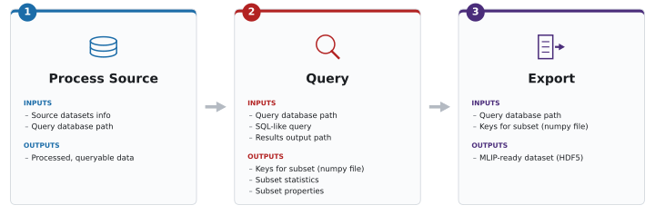

.. raw:: html

   

     <h1 style="font-size: 2.5rem; margin-bottom: 0.5rem;">
       ChemReporter
     </h1>
   

================================================================================

**ChemReporter** is a framework that
converts arbitrary molecular and materials datasets into a unified, queryable
representation and exports the results directly into MLIP-ready training
data. It operates in three decoupled stages:

- **Process** — parse raw datasets into a partitioned Apache Parquet
  repository enriched with structural, physical, and chemical metadata.
- **Query** — filter and sample this repository via a CLI or Python API using
  arbitrary selection criteria, from simple physical constraints to custom,
  user-defined strategies.
- **Export** — stream the selected subset into an HDF5 file ready for direct
  use in modern MLIP training frameworks.

ChemReporter is available on `GitHub <https://github.com/instadeepai/chemreporter>`_
and `PyPI <https://pypi.org/project/chemreporter>`_ under the Apache License 2.0.

Getting started
---------------

New to ChemReporter? Head to :doc:`guides/installation` to install the
package, then see the :doc:`guides/cli` reference to run your first
``process`` / ``query`` / ``export`` pipeline.

Beyond that walkthrough, these docs also cover:

- **Configuration** (:doc:`reference/configs`) — every YAML field accepted by
  the ``process`` / ``query`` / ``export`` commands.
- **Query syntax** (:doc:`reference/query_examples`) and the
  **Database Schema** (:doc:`reference/database_schema`) — how to write
  filter expressions and which fields are available to filter on.
- **Sampling** (:doc:`guides/sampling`) — built-in and custom strategies for
  selecting a subset from your filtered results.
- **Export Schema** (:doc:`reference/hdf5_schema`) and **Units**
  (:doc:`reference/units`) — the internal layout of exported HDF5 files and
  the physical units used throughout.
- **Supported Source Datasets** (:doc:`source_datasets/source_datasets`) —
  which raw datasets ChemReporter can ingest, and how each one's reader
  implementation differs.
- **Advanced Tutorials** (:doc:`guides/tutorials`) — hands-on, Python-API
  examples for leak-free data splits, dataset audits, and data curation,
  going beyond the standard CLI usage above.

.. toctree::
   :maxdepth: 1
   :caption: Contents:

   guides/installation
   guides/cli
   reference/configs
   reference/query_examples
   reference/database_schema
   guides/sampling
   reference/hdf5_schema
   reference/units
   source_datasets/source_datasets
   guides/tutorials
